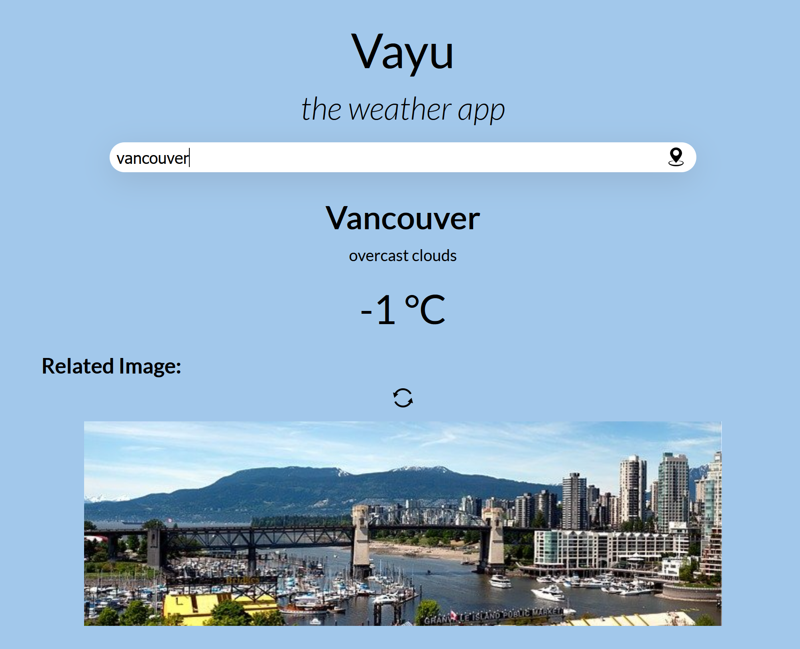

# vayu-theWeatherApp
<strong>a simple weather app which shows the temperature and a related image of the city</strong>  
<strong>Hosted Project: </strong><a href="https://weather-app-tejasdhanani.netlify.app/" target="_blank">https://weather-app-tejasdhanani.netlify.app/</a>
<h3>Description: </h3>
 It generates temperature of the searched place using <a href="https://openweathermap.org/api" target="_blank">OpenWeatherMap-API</a>.
It also shows a related image of the city using <a href="https://pixabay.com/service/about/api/" target="_blank">Pixabay-API</a>. User can also reload the image by 
pressing the reload button.

<h3>Screenshot: </h3>

